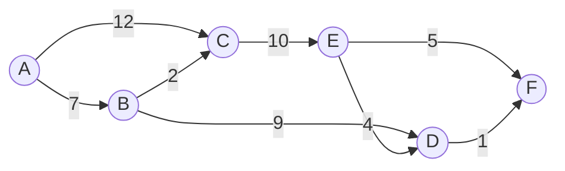

# Dijkstra's Algorithm

{: width="972" height="589" .w-50 .right}
Dijkstra's Algorithm is a **shortest path algorithm** that is widely used to find the minimum cost path from a source node to all other nodes in a graph. It's especially useful in scenarios like **network routing**, where optimal paths between routers must be computed. 
During my exploration, I came across the use of Dijkstra's Algorithm in **OSPF (Open Shortest Path First)** — a dynamic routing protocol that uses this algorithm under the hood to determine the most efficient routes.
## What I Learned About this Algorithm
- Starts with the source node and assume all other nodes are at an **infinite** distance.
- Visit all **neighboring nodes** and calculate their distance from the source using:
``` new_cost = previous_cost + edge_cost ```
- If this `new_cost` is **less than** the current stored cost, **update** it.
- Continue this process until all nodes have been visited.  


## Example problem I took


For easier implementation, I calibrated the nodes for the vector:
```A → 0, B → 1, C → 2, D → 3, E → 4, F → 5```


##  Program

We'll use Rust to implement Dijkstra's Algorithm due to its performance and expressive type system.

```bash
cargo new djax --vcs none && cd djax && code .
```

```rust
type Graph = Vec<Vec<(usize, usize)>>;
const INF:usize = usize::MAX;
fn main() {
    let graph = vec![
        vec![(1,7),(2,12)],
        vec![(2,2),(3,9)],
        vec![(4,10)],
        vec![(5,1)],
        vec![(3,4),(5,5)],
        vec![]
    ];
    let start = 0;
    let dist = djax(&graph, start);
    println!("{} => {:#?}", start, dist);
}


fn djax(graph:&Graph, start:usize)->Vec<usize>{
    let n = graph.len();
    let mut dist = vec![INF;n];
    let mut visited = vec![false;n];

    dist[start] = 0;

    for _ in 0..n{
        let mut mini = None;
        for i in 0..n{
            if !visited[i] && (mini.is_none() || dist[i]< dist[mini.unwrap()]){
                mini = Some(i);
            }
        }
        let u = mini.unwrap();
        visited[u] = true;

        for &(v, weight) in &graph[u]{
            let current_dist = dist[u];
            let updated_dist = current_dist+weight;

            if updated_dist< dist[v]{
                dist[v] = updated_dist;
            }
        }
    }

    dist
}

```


##  Explanation

* **Node Mapping**: Converted nodes A–F to 0–5 for simpler indexing.
* **Graph Type Alias**: `Graph = Vec<Vec<(usize, usize)>>`, where each entry is a `(neighbor, cost)` tuple.
* **Initialization**:

  * All distances set to `INF` except the start node (0).
  * All nodes are initially unvisited.
* **Relaxation**:

  * Select the **unvisited node with the smallest distance**.
  * Visit its neighbors and **relax the edges** if a shorter path is found.
* **Repeat** until all nodes are processed.

---

##  Output

Here’s the output from the terminal:


It shows the shortest distance from **node A (0)** to all other nodes.


## Summary

Dijkstra’s Algorithm is a cornerstone in shortest path problems and underpins real-world routing protocols like **OSPF**. This Rust implementation illustrates how to approach it using adjacency lists and simple control logic.

