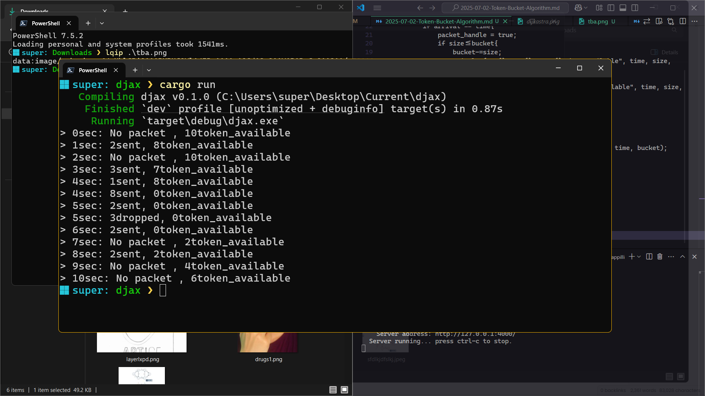

## So Basically this is how it works:

{: width="972" height="550" .w-50 .right}

- has fixed rate of refilling bucket , and bucket has max cap
- we consume or subtract the packet that was transmitted over the specific period of time and get the bucket's available total token
- the bucket's total token that was calculated is refilled by fixed rate of refilling over the specific period of time-{u should know that refilling is per time, so multiple data packet coming from over at same time wont refill, u have to complete that time instance to get next refill}
- this thing continues till our time is valid and is matching to our dynamic or static hard coded time limiter
- the packet gets droped if the bucket available token can't handle the packet that is transmatied or smaller 

_note: the packet no matter how much transitted and how much refil happens, but the refilling is capped upto bucket limiter_


<samp>
so lets code a basic hard coded time limited based token bcuket algorithm in rust due to its efficient memory safety and other features
</samp>
```rust
pub fn rtb(){
    let rate = 2;
    let capacity = 10;
    let mut bucket = capacity;
    
    let mut last_time = 0;

    let packets  = vec![
        (1,2),
        (3,3),
        (4,1),
        (4,8),
        (5,2),
        (5,3),
        (6,2),
        (8,2)        
    ];


    for time in 0..11{
        let elapsed = time - last_time;
        bucket = std::cmp::min(capacity, bucket+ rate*elapsed);
        last_time = time;
        let mut packet_handle = false;

        for &(arrival, size) in &packets{
            if arrival == time{
                packet_handle = true;
                if size<=bucket{
                    bucket-=size;
                    println!("> {}sec: {}sent, {}token_available", time, size, bucket);
                }else{
                    println!("> {}sec: {}dropped, {}token_available", time, size, bucket);
                }
                
            }
        }
        if !packet_handle{
            println!("> {}sec: No packet , {}token_available", time, bucket);
        }

    }


}
```
_i.e. this is imported on the main.rs and ran through it._

**Explanation:** 
first, I defined the fixed rate of refilling of bucket  and defined the capacity that bucket can't exceed, then defined other important stuff and created our packet transer for the specific time, and its size correspondance to type vector on tuple and added them.
then i created a time loop which is hard coded but effiective for a practical demonstration which goes from 0 to (11-1), and we defined elapsed and bucket created -> which caps our bucket to the capacity of the defined value and since our data is random so basically we have to multiple each sec with rate incremental, instead of just incrementing the specific time due to the time arent at diff of 1[or same ratio], and added last time, and created  packet handler boolean and started as flase value cause we dont have no dropped packet cause program hasn't even begun so we need to like make sure of it and now our main logic 
we basically deserlized our tuple vec to arrival and size refrences and continued till the arrival and time is matching.
```bash
now:
**if the size of packet sent is lesser than or equal to bucket:** 
we subtract the bucket token with size and printed important stuff, and same
**else**
packet dropped 
**and**
at end of loop we get the packet thandle if its not true, then its no packet 
```
## this is solution:
{: .shadow }
